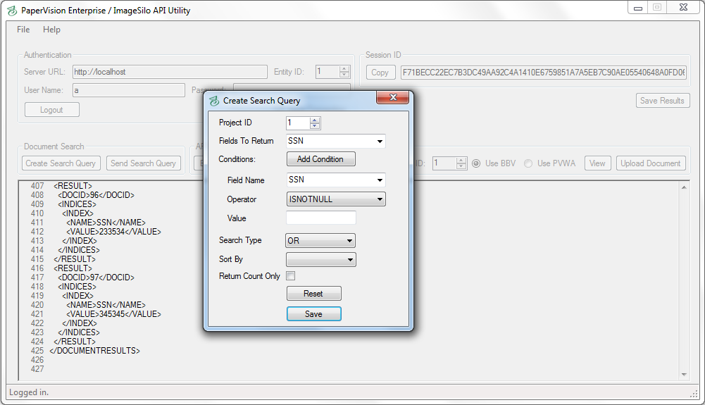
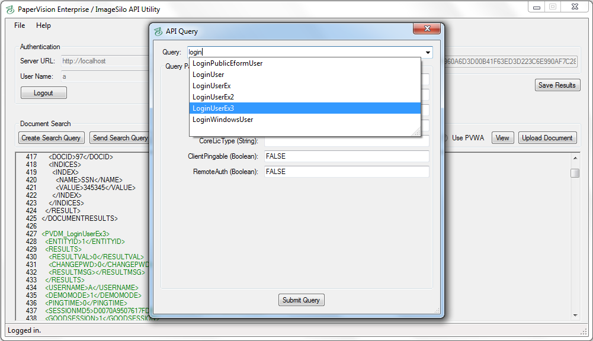

# PVE / ImageSilo API Utility

A simple tool to demonstrate how you can interact with our web services on both a local PVE installation or on ImageSilo.

  
  
Documentation for the API can be found in the menu under Help.

## Functionality

- Build and send SOAP queries using the Document Search Service

  
  
Multiple conditions can be added.

- Build and send XML queries using PVE/Silo's Web Service

  
  
Search through our API library and simply enter the required information for each query.

- View documents using either the Browser-Based Viewer or the PaperVision Web Assistant
- Upload new documents to PVE/Silo.
